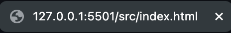

# Create Your Portfolio on Pages

### Create an Account at https://github.com/

[Github Guide to creating an account](https://docs.github.com/en/get-started/start-your-journey/creating-an-account-on-github)

- Click on [this link](https://github.com/Landwhich/GithubWorkshop)(If you don't already have the github page open) and sign in with your account
- click on the fork button, then name your forked version, and keep the default settings
- after you've created your forked version, navigate to "settings" and the "pages" subsection
- Select deploy from master branch and check out your site

### HTML and css basics

html code is built up of "tags" that look like this `<div></div>`. Most elements have an opening and closing tag and will have tags nexted inside them:
```
<div class="arrow-button-container">
    
    <button class="arrow-button" onclick="smoothScroll('portfolio-grid', -200)"></button>
</div>
```
many elements will also have attributes within them like `src class id events` and more

One important attribute is `class`. Elements with a class can be referenced in a `.css` file. Cascading Style Sheets are used to assign styles to elements to change their appreance or behaviour. css structure for an arrow button looks like this:
```
.arrow-button:hover{
    transition: background-color 0.25s;
    background-color: rgba(0,0,0,0.5);
    cursor: pointer;
}
```
here, the colour is changed using an rgba field, a transition is applied to the background colour (when the colour changes) and the mouse pointer icon is changed. the `arrow-button` class has the `hover` state specificer indicated by the `:` this means the color and pointer will be changed only when hovering over this element

### Tasks

1. Change Global Font Default

In the `reset.css` and `index.html` file, you'll see both:
```
*{
    color:rgba(222,222,222);
    text-decoration: none;
    margin: 0;
    padding: 0;
    font-family: 'Montserrat';
}
```
and 
```
 <!-- MONTSERRRAT --> (this is a comment to label the font name, use <!-- and --> to comment a line of code in html)
    <link rel="preconnect" href="https://fonts.googleapis.com">
    <link rel="preconnect" href="https://fonts.gstatic.com" crossorigin>
    <link href="https://fonts.googleapis.com/css2?family=Montserrat:ital,wght@0,100..900;1,100..900&display=swap" rel="stylesheet">
```
the first is a reference to all elements in the index file, the `font-family` field sets all the text to Monserrat by default, but requires an import in every html to be used in that file. Go to https://fonts.google.com/ then choose a font you like. click 'get font' then 'get embedded code' and copy the provided code into index.html to change your font. (don't forget to update `reset.css`)

2. Change Portfolio Sections

Most of our site is full of boilerplate (sample text), but it should be full of things that interest you! 
```
<!-- PORTFOLIO SECTION 1 -->
<div id="section-1" class="portfolio-item">
    <div class="portfolio-item-image-container">
        <h1 class="portfolio-item-header">Carleton FED</h1>
        
    </div>
    <h1 style="margin: 3vh 0">Make Carleton Your First Choice for Engineering and Design</h1>
    <h3>As one of the nation’s leading institutions in the study and research of engineering, architecture, industrial design, and information technology, Carleton provides students with an environment that is challenging, diverse and flexible.<br><br>
        Our comprehensive platform of programs prepares graduates for rewarding careers in the real world, by equipping them with the knowledge and skills that are highly desirable in today’s fast-paced, technology-driven society.</h3>
</div>
```
Important to change the text and `src` attribute in the `img` tag, as well as the button linked to this portfolio section

3. Give your Website a title and icon image

right now your page looks like this

or something like this. your title or icon may vary, but it will have a default appearance

add a title by adding text between title tags: `<title></title>`

then add an icon by adding this tag inside your `<head></head>` tags (these are near the top). '<link rel="icon" type="image/x-icon" href="/images/favicon.ico">' you will want to change the `href` field. this can be a web link (think http) or a link to a remote location (like the link used here). this is your reference to the image you want to use, you may want to use the `style` attribute to modify how it looks. 

4. Play Around with different stylings

There are limitless ways to style a website, go crazy! changing background-color in `index.html` is a good place to start but there are many ways to change up the look of your site, you also add/move sections around by copyting and pasting them in the html files. try making your own page in `portfolio.html` as well

We can't cover everything in a workshop but these are excellent resources for reference: 

[W3 Schools - HTML](https://www.w3schools.com/html/)
[W3 Schools - CSS](https://www.w3schools.com/css/)


